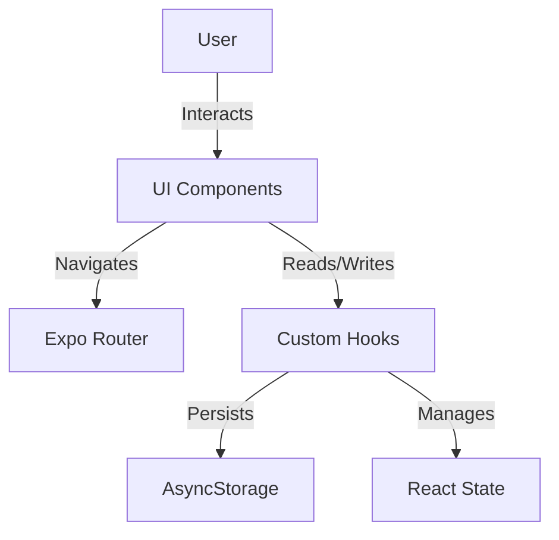

# Architecture Overview

This document describes the high-level architecture of **MDF Note**, a React Native application built with Expo.

## High-Level Diagram

## Core Components

### 1. Presentation Layer (UI)
-   **Screens:** Located in `app/`. Each file corresponds to a route.
-   **Components:** Reusable UI elements in `components/` (e.g., NoteCard, Header).
-   **Styling:** Uses `StyleSheet` for performance and consistency.

### 2. Navigation Layer
-   **Library:** `expo-router`
-   **Structure:** File-based routing.
    -   `app/_layout.tsx`: Root layout and providers.
    -   `app/(tabs)/`: Tab-based navigation structure.
    -   `app/index.tsx`: Entry screen.

### 3. Data Layer (State & Storage)
-   **Local Storage:** `@react-native-async-storage/async-storage` is used for persisting notes and user preferences.
-   **State Management:** React Context API or simple Hooks pattern (`useNotes`, `useTheme`).
-   **Data Flow:** Unidirectional data flow (Parent -> Child).

## Design Principles

-   **Mobile-First:** Designed for touch interactions and small screens.
-   **Offline-First:** Critical data persists locally; app works fully offline.
-   **Component-Based:** Modular, reusable components for maintainability.
-   **Type Safety:** Strict TypeScript usage to prevent runtime errors.

## Directory Responsibilities

| Directory | Responsibility |
|Data|Description|
| `app/` | Screens and routing configuration. |
| `components/` | Presentational components (dumb components). |
| `hooks/` | Business logic and reusable state logic. |
| `constants/` | App-wide config (Colors, Layouts). |
| `assets/` | Static files (Images, Fonts). |
